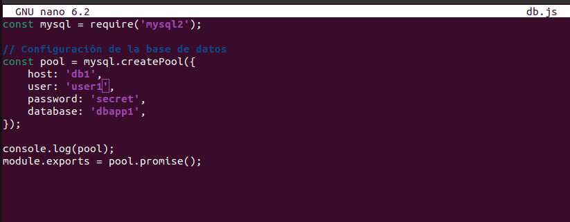
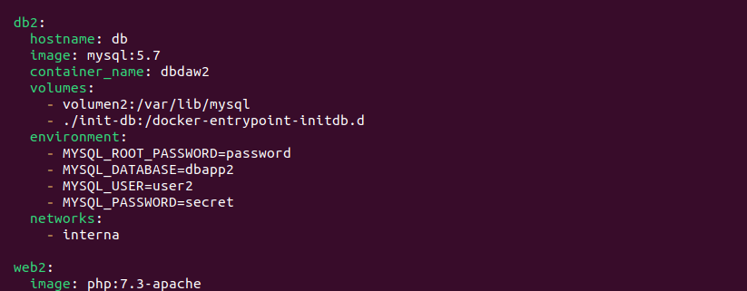
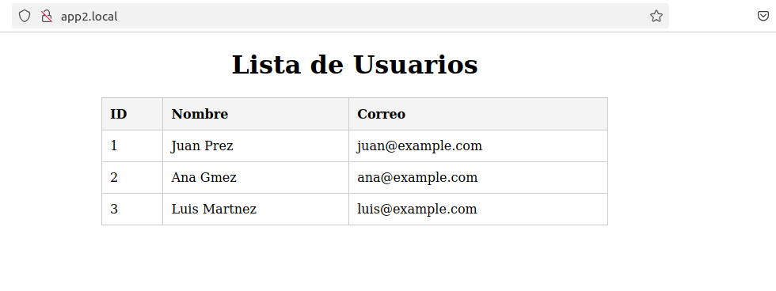

# Práctica de despliegue con Docker

## Punto de partida

- Usa la máquina: "Practicas Docker Ubuntu"
- Borra todos los contenedores e imágenes:

  ```bash
  docker rm -f $(docker ps -aq)
  docker rmi -f $(docker images -aq)
  ```

## Objetivo

- Debes desplegar las siguientes aplicaciones:
  - https://github.com/rafacabeza/demoapinode
  - https://github.com/rafacabeza/demoappphp
- Debes usar un contenedor con un proxy.
- Debes usar un contenedor por cada aplicación y dos contenedores de bases de datos.
- Opcionalmente puedes usar contenedores para phpmyadmin
- Las aplicaciones serán app1.local y app2.local.

## Desarrollo de la práctica

- Para hacerlo debes usar un único fichero docker-compose.yml teniendo en cuenta lo siguiente:
  - Inicia el proceso clonando el repositorio entornods(https://github.com/rafacabeza/entornods)
  
  - Elimina el servicio web1
  - Comprueba que funciona correnctamente el sitio web2.com (deberas editar el fichero hosts)
  
  - Deja una única red (network) en todos los contenedores. Llámale como consideres.

### Sitio app1.local

- Añade un servicio db1 (puedes renombrar el servicio db como db1)
  - El volumen de datos debe llamarse volumen1 y debe gestionarlo docker
  - Debes usar una base de datos llamda dbapp1 
  - Debes usar un usuario user1 y contraseña secret
  
  
  - Carga el sql correspondiente. Puedes hacerlo con phpmyadmin o mediante consola (docker exec -it <contenedor> mysql ....)
  
  
- Añade un servicio app1 para que sirva la aplicación "demoapinode". 
  - Descarga la aplicación en "entornods/demoapinode".
  
  - Fíjate en el docker-compose.yml que hay en el repositiro, te ayudará a definir el servicio en tu docker-compose pero deberás modificar algunas cosas.
  - Deberás añadir en variable de entorno "VIRTUAL_HOST", fíjate en web2
  
  - Revisa el resto de parámetros
  
- Comprueba que funciona la ruta: http://app1.local


### Sitio app2.local

- Añade un servicio db2 para la base de datos de "demoappphp"
  - El volumen de datos debe llamarse volumen2 y debe gestionarlo docker
  - Debes usar una base de datos llamda dbapp2 
  - Debes usar un usuario user2 y contraseña secret
  
  
  - Carga el sql correspondiente. De nuevo, puedes usar phpmyadmin o la consola.
  
  
- Añade un servicio app2 que sirva la aplicación "demoappphp"
  - Descarga la aplicación en "entornods/demoappphp".
  
  - Fíjate en el docker-compose.yml que ha en repositorio, te ayudará a definir el servicio en tu docker-compose pero deberás modificar algunas cosas.
  - Deberás añadir en variable de entorno "VIRTUAL_HOST", fíjate en web2
  
  
- Comprueba que funciona la ruta: http://app2.local/api/deseos


### Un poco más de documentación. 

- Si te da tiempo, como tarea extra:
  - Muestra una lista de todos las redes y volúmenes  

    ```
    docker volume ls
    docker network ls
    ```

- Identifica la red y volúmenes utilizados y captura los datos de los mismos:

    ```
    docker inspect <nombre-volumen>
    docker inspect <nombre-red>
    ```