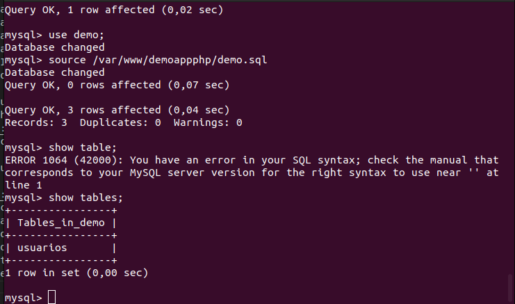
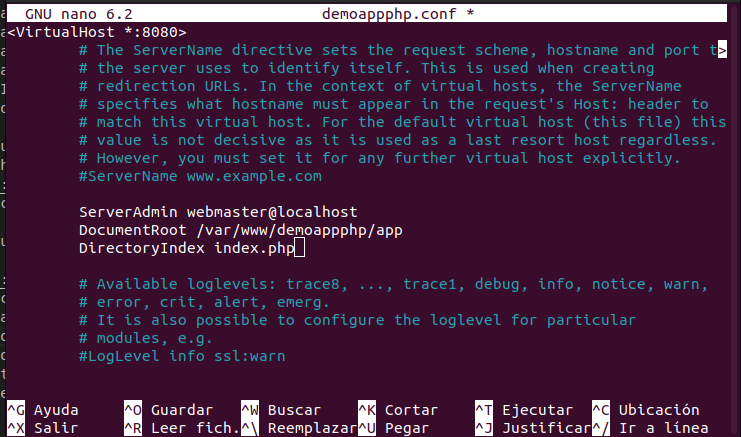
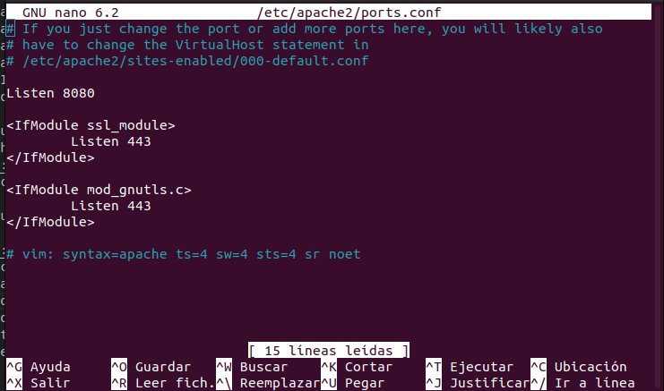
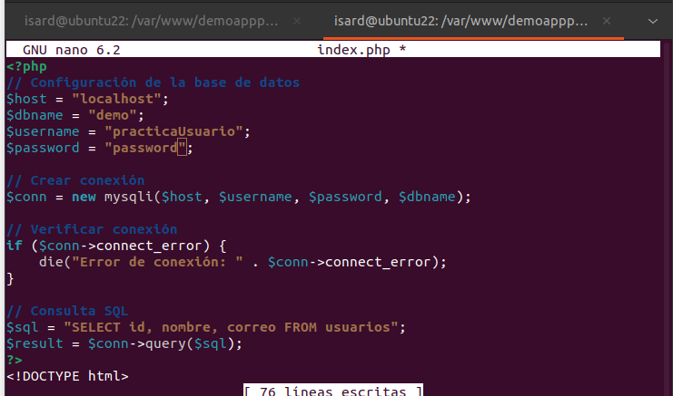
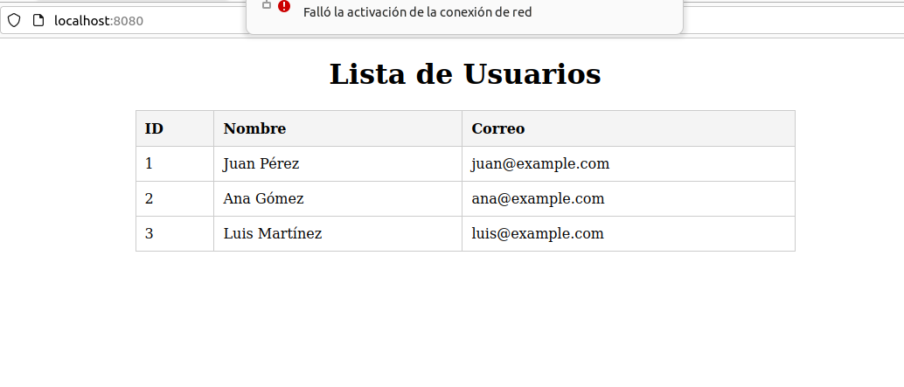
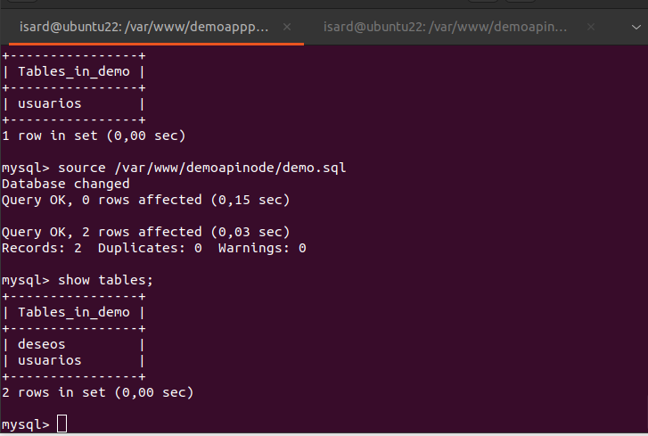
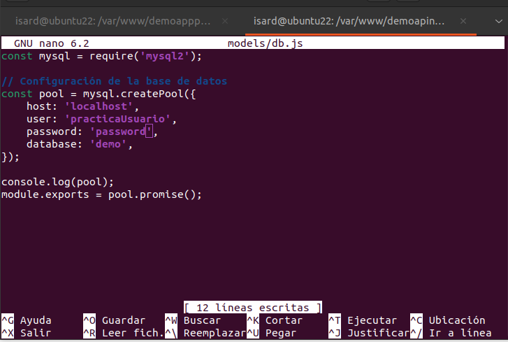
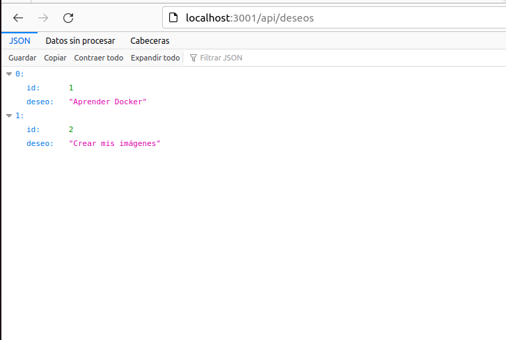
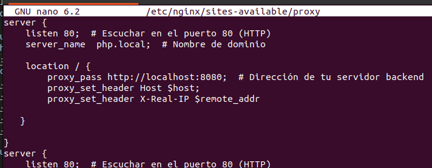
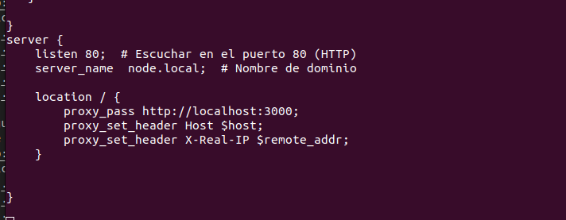

- Máquina:Escritorio Pr. Combinada Serv. Ap.
	- Instalado php
	- Instalado nginx
	- Instalado node
	- Instalado mysql
	- PENDIENTE php y complementos
	- Opcional phpmyadmin

- Despliegue 1:
	- Apache puerto 8080
	- http://localhost:8080
	- Aplicación demo de otros días.
	
	
	
	
	
	
- Despliegue 2
	- Node puerto 3000
	- http://localhost:3000
	- Aplicación demo de otros días
	
	
	

- Configuración proxy inverso
	- Sitio1: http://php.local	
	- Sitio1: http://node.local
	- Puerto 80
	- Recuerda que debes configurar el fichero hosts
	
	
